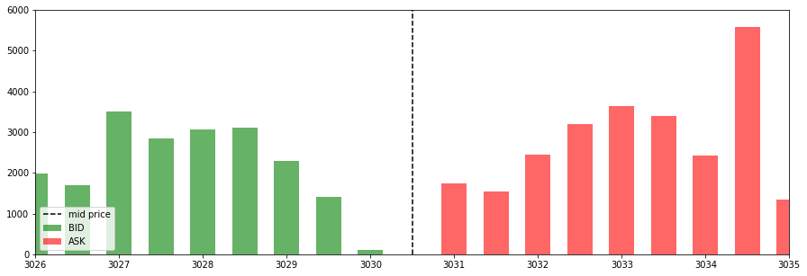

# LimitOrderBook
> Stock market predictions using limit order books dataset.
> Based on this [paper](https://arxiv.org/pdf/1512.03492.pdf).

## Table of contents
* [General info](#general-info)
* [Screenshots](#screenshots)
* [Technologies](#technologies)
* [Libraries](#Libraries)
* [Results](#Results)
* [Status](#status)
* [Inspiration](#inspiration)

## General info
Given LOB (Limit Order Book) data and certain points in time our goal is to predict whether the price will increase or decrease.  
We will be using LOB data from London stock market, collected for September 2013.  
Main method used is Logistic regression.  

## Screenshots

## Technologies
* Python - version 3.7.3

## Libraries
* numpy
* pandas
* sklearn
* scipy
* csv
* matplotlib
* seaborn

## Results
* 51.6 % baseline on test data
* around 54% accuracy on train data
* around 55% accuracy on test data

## Status
Project is: _finished_,

## Inspiration
Data Mining class.

## Authors
Created by [@TheFebrin](https://github.com/TheFebrin) and [@MatMarkiewicz](https://github.com/MatMarkiewicz)
